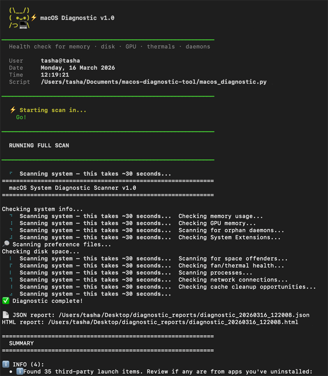
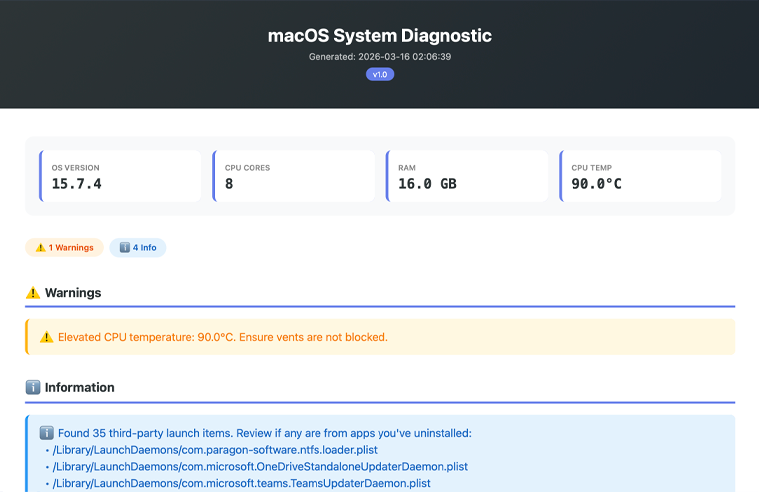

# macOS Diagnostic Tool

A free, open-source health check script for macOS. Run it whenever your Mac feels slow, or as a regular health check.

**No coding experience needed.**

🌐 **English** | [Bahasa Indonesia](README.id.md)

---

## Why This Exists

I built this after my Mac started slowing down and I needed a way to diagnose it. It's been useful enough that I figured others might find it helpful too.

---

## What It Checks

| Check | What It Catches |
|---|---|
| Memory & Swap | RAM pressure, swap usage scaled to your Mac's RAM |
| GPU Memory | High VRAM usage from graphics-heavy apps |
| Orphan Daemons | Background services left behind by uninstalled apps |
| System Extensions | Too many OS-level add-ons slowing things down |
| Disk Space | Low disk warnings, top space consumers ranked |
| Fan/Thermal | CPU temperature, thermal log warnings |
| Processes | Zombie processes, top CPU/memory hogs |
| Network | Suspicious background services listening on ports |
| Preference Files | Leftover config files from apps you've uninstalled |
| Cache Cleanup | Quick wins for freeing up disk space |

**Output:** A pretty HTML report + JSON data file, saved to `~/Desktop/diagnostic_reports/`.

---

## Quickstart

### Step 1 — Open Terminal

Terminal is a built-in Mac app that lets you run commands — think of it like texting instructions to your Mac. It looks scarier than it is.

**How to open it:** Press `Cmd + Space`, type `terminal`, press `Enter`.

### Step 2 — Run these 3 commands

Copy and paste them one at a time, pressing `Enter` after each:

```bash
git clone https://github.com/watashiwatasha/macos-diagnostic-tool.git ~/Documents/macos-diagnostic-tool
```

```bash
chmod +x ~/Documents/macos-diagnostic-tool/run_diagnostic.sh
```

```bash
bash ~/Documents/macos-diagnostic-tool/run_diagnostic.sh
```

> **Don't have Git?** Click the green **Code** button at the top of this page → **Download ZIP** → unzip it → move the folder to `~/Documents/macos-diagnostic-tool/` → then run the last two commands above.

### Step 3 — Wait ~30 seconds

You'll see it scan through each check. It may ask for your **password** — this is normal and safe. Some checks need admin access to read system data. Your password is never stored or sent anywhere.

The HTML report will open automatically in your browser when done.



---

## What the Report Looks Like



---

## Running It Again

Just run this one command each time:

```bash
bash ~/Documents/macos-diagnostic-tool/run_diagnostic.sh
```

---

## Understanding the Report

The report uses three severity levels:

**🚨 Critical** — Fix this now. Examples:
- Swap usage too high relative to your Mac's RAM
- Disk above 90% full
- Old app leftovers still running in the background

**⚠️ Warning** — Keep an eye on it. Examples:
- Disk above 80% full
- An app using an unusually high amount of memory
- Elevated CPU temperature

**ℹ️ Info** — Good to know, not urgent. Examples:
- Leftover preference files from old apps
- Large Downloads or Caches folder you could clean up
- Trash hasn't been emptied in a while

---

## Getting Help From AI (Optional)

After running the diagnostic, you can paste the results into any AI assistant (Claude, ChatGPT, etc.) and ask it to explain the findings in plain English.

Example prompt:
```
I ran a macOS diagnostic. Here are the results — what should I fix first?

[paste your report here]
```

The AI will prioritize the issues, explain what they mean, and give you step-by-step fix instructions.

---

## Requirements

- macOS 10.15 Catalina or later
- Python 3 (comes pre-installed on modern Macs)
- No additional packages needed

**Not sure if you have Python 3?** Open Terminal and run:
```bash
python3 --version
```
If you see `Python 3.x.x`, you're good. If not:
```bash
xcode-select --install
```
> **Don't worry — this won't install the full Xcode app.** It only installs a small tools package (~500MB) that includes Python. The full Xcode (15GB+) is a separate thing and is not required here.

---

## Privacy & Safety

- Runs entirely on your Mac — nothing is uploaded
- Only reads process names, memory stats, and file sizes — not file contents
- Reports stay in `~/Desktop/diagnostic_reports/` — you own them
- Open source — read every line of code yourself
- No third-party dependencies

---

## Troubleshooting

**It asked for my password — is that normal?**

Yes, completely normal. Some checks need admin access to read system data. Your password is never stored or sent anywhere. Just type it and press `Enter` (you won't see it appear as you type — that's normal too).

**"Permission denied" error**

```bash
sudo -K
bash ~/Documents/macos-diagnostic-tool/run_diagnostic.sh
```

**"python3: command not found"**

```bash
xcode-select --install
```

**Report didn't open automatically**

1. Open Finder
2. Go to `Desktop > diagnostic_reports`
3. Double-click the latest `.html` file

**Script runs but shows no issues**

That's a good thing! It means your system is healthy. Run it whenever you want to check your system's health.

---

## Report Files

Each scan creates two files in `~/Desktop/diagnostic_reports/`:

| File | Purpose |
|---|---|
| `diagnostic_YYYYMMDD_HHMMSS.html` | Visual report — open in any browser |
| `diagnostic_YYYYMMDD_HHMMSS.json` | Raw data — useful for comparing scans over time |

Keep old reports to track trends over time.

---

## Typical Workflow

```
1. Open Terminal
2. Run: bash ~/Documents/macos-diagnostic-tool/run_diagnostic.sh
3. Report opens in browser automatically
4. Glance at any red/yellow alerts
5. Fix critical issues if any
6. Save report for future comparison
```

Total time: ~2 minutes.

---

## Changelog

See [CHANGELOG.md](CHANGELOG.md).

---

## License

MIT — free to use, modify, and share. See [LICENSE](LICENSE).
